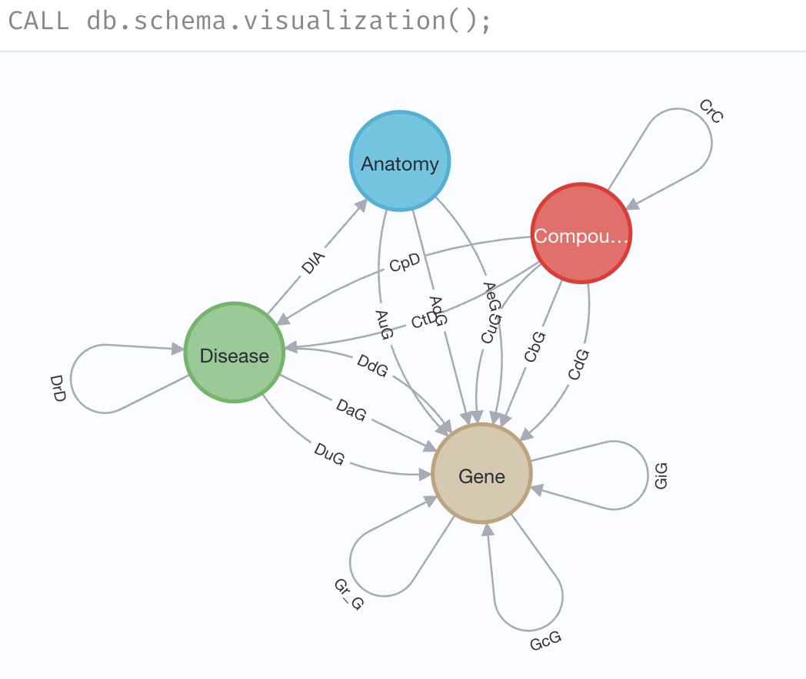

#  Neo4j Documentation

## Install Neo4j
### **Download and Install Neo4j**
```bash
brew install neo4j
```

### **Start Neo4j**
```bash
neo4j start
```

### **Set Up Neo4j User and Password (via Terminal)**
1. Open a terminal and **start the Neo4j shell** using:
   ```bash
   cypher-shell -u neo4j -p neo4j
   ```
   - `-u` specifies the **username** (`neo4j` by default)
   - `-p` specifies the **password** (default is `neo4j`)
   
2. When prompted, change the default password:
   ```cypher
   CALL dbms.security.changeUserPassword('<your-password>');
   ```
   Replace `<your-password>` with a secure password of your choice.

3. Exit the shell:
   ```bash
   :exit
   ```

### **Create the `.env` file** (in your project root)
Create a new `.env` file and add the following lines:
```ini
NEO4J_URI=bolt://localhost:7687
NEO4J_USER=neo4j
NEO4J_PASSWORD=<your-password>
```

### **Python Scripts Automatically Load `.env`**
You do **not** need to manually load environment variables. The project uses `python-dotenv`, which automatically reads from `.env` when running scripts.


## Install Required Python Packages
```bash
pip install -r requirements.txt
```

## Run Neo4j Scripts
### **Test Neo4j Connection**
```bash
python scripts_neo4j/db_connection.py
```

### **Load Data into Neo4j**
```bash
python scripts_neo4j/load_data.py
```

### **Run Queries via Terminal**
Query 1:
   Given a disease id, what is its name,
   what are drug names that can treat or palliate this disease,
   what are gene names that cause this disease, and
   where this disease occurs?
   Obtain and output this information in a single query.
```bash
python scripts_neo4j/queries.py 1 Disease::DOID:1686
```
Query 2:
    We assume that a compound can treat a disease
    if the compound up-regulates/down-regulates a gene, 
    but the location down-regulates/up-regulates the gene 
    in an opposite direction where the disease occurs. 
    Find all compounds that can treat a new disease 
    (i.e. the missing edges between compound and disease excluding existing drugs). 
    Obtain and output all drugs in a single query.
```bash
python scripts_neo4j/queries.py 2
```

### **Run Neo4j GUI Interface**
```bash
python scripts_neo4j/gui.py
```

# Neo4j Database Schema
This schema defines the key nodes and relationships used in the Neo4j database for the project.

## Node Labels and Properties

- **:Compound** `{id, name}`
- **:Disease** `{id, name}`
- **:Gene** `{id, name}`
- **:Anatomy** `{id, name}`


## Neo4j Schema Visualization

Below is the database schema visualization generated from Neo4j:




## Relationships Present in the Database

The following relationships establish for query (based on `CALL db.relationshipTypes();`):

- **[:GiG]** *(Gene)-[:GiG]->(Gene)* – Gene interacts with another gene.
- **[:DdG]** *(Disease)-[:DdG]->(Gene)* – Disease-downregulated gene.
- **[:DlA]** *(Disease)-[:DlA]->(Anatomy)* – Disease localizes to an anatomical structure.
- **[:CtD]** *(Compound)-[:CtD]->(Disease)* – Compound treats a disease.
- **[:CuG]** *(Compound)-[:CuG]->(Gene)* – Compound upregulates a gene.
- **[:DaG]** *(Disease)-[:DaG]->(Gene)* – Disease-associated gene.
- **[:CpD]** *(Compound)-[:CpD]->(Disease)* – Compound palliates a disease.
- **[:AdG]** *(Anatomy)-[:AdG]->(Gene)* – Anatomy downregulates a gene.
- **[:AuG]** *(Anatomy)-[:AuG]->(Gene)* – Anatomy upregulates a gene.
- **[:CdG]** *(Compound)-[:CdG]->(Gene)* – Compound downregulates a gene.
- **[:DuG]** *(Disease)-[:DuG]->(Gene)* – Disease-upregulated gene.

# Potential Improvements

**1. Optimize Data Storage & Retrieval**

Implement appropriate indexes to enhance data access speed and efficiency.

**2. Leverage Cypher Over Python**

Shift data processing tasks from Python to Cypher queries to reduce overhead and improve performance.

**3. Refine GUI Design**

Improve the graphical user interface for better responsiveness and user experience.

